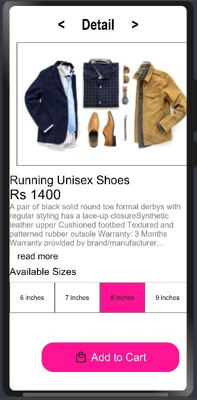
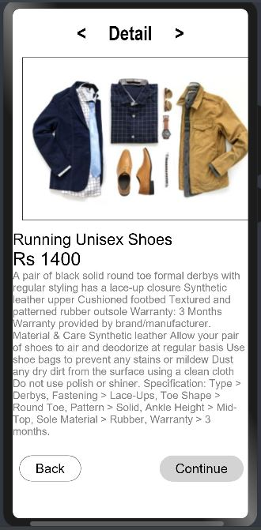

# material button

## Introduction

Material component design of Button for OpenHarmony.

## Screenshots

 

# Adding Dependencies:

For using material button in your app, add the below dependency in entry/package.json

```
"dependencies": {
"@ohos/material-button": "file:../Material_Button"
}
```

## Usage Instructions

##### 1. Material Button is added by importing Mbutton to application, and by passing Button options we can set the attributes of button, like BackGround, FontSize etc..

```javascript
import {MButton, ButtonVariant, ButtonOptions} from "@ohos/material-button"

@Component
struct Index {
  build() {
    Column() {
      MButton(variant: ButtonVariant.CONTAINED,
      backgroundColor: "#D3D3D3",
      content: "Continue",
      fontSize: 20,
      margin: { left: 120 },
      fontColor: Color.Black,
      cbOnClick: () => this.readMoreOpenClose())
    }
  }

  readMoreOpenClose() {
    prompt.showToast({message: "Button clicked"})
  }
}
```
##### 2. Adding Material Toggle button to the application, we can set both Text and Icon for Toggle button.
```javascript
import {ToggleButton, ButtonOptions, ToggleButtonOptions} from "@ohos/material-button"
@Component
struct Index {
    build() {
      Column() {
        ToggleButton({
          data: [{ content: "Text1", checked: false, enable: true }, {content: "Text2", checked: true, enable: true}, { content: "Text3", checked: false }],
          backgroundColor: Color.White,
          selectedBackgroundColor: "#FF1493",
          width: 90,
          height: 60,
          fontSize: 13,
          toggleBorderWidth: 1,
          fontColor: Color.Black,
          cbSelectionOnClick: (checkedIndexes) => this.sizeSelect(checkedIndexes)
      })
      }
    }
    
    sizeSelect(checkedIndexes: number[]) {
      prompt.showToast({message: "Toggle Button Selected Index " + checkedIndexes[0]})
    }
}
```

### Attributes
#### Button Options

| Attribute | Type     | Description                |
| :-------- | :------- | :------------------------- |
| `variant` | `ButtonVariant` | Select Variant TEXT, OUTLINED, CONTAINED |
| `clickCallback` | `(event: ClickEvent, responseCode: number) => void` | Callback to set to listen ClickEvent |
| `responseCode` | `number` | Response code set during call back is returned same during call back |
| `content` | `string` | button text |
| `iconSrc` | `string or PixelMap or Resource` | icon path |
| `borderStyle` | `BorderStyle` | border style |
| `borderWidth` | `number` | border width |
| `borderRadius` | `Length` | border radius |
| `backgroundColor` | `ResourceColor` | background color |
| `fontColor` | `ResourceColor` | font color |
| `borderColor` | `ResourceColor` | border color |
| `fontSize` | `Length` | font size |
| `width` | `Length` | width |
| `height` | `Length` | height |
| `margin` | `Margin or Length` | margin |
| `padding` | `Padding or Length` | padding |
| `elevation` | `number` | elevation |
| `rippleColor` | `ResourceColor` | Ripple color |

#### Toggle Button Options

| Attribute | Type     | Description                |
| :-------- | :------- | :------------------------- |
| `data` | `TextualToggleType[] or IconToggleType[]` | List of Text or Icon buttons |
| `width` | `Length` | width of each button |
| `height` | `Length` | height of each button |
| `cbSelectionOnClick` | `(checkedIndexes: number[]) => void` | call back with selected index |
| `toggleBorderWidth` | `number` | toggle Border width |
| `borderWidth` | `number` | border width |
| `backgroundColor` | `ResourceColor` | background color |
| `selectedBackgroundColor` | `ResourceColor` | selected background color |
| `fontColor` | `ResourceColor` | font color |
| `fontSize` | `Length` | font size |
| `checkedVariant` | `ButtonVariant` | selected button variant |
| `checkedBackgroundColor` | `ResourceColor` | selected background color |

## Contribution Code
Any questions found during the use process can be submitted to us by [Issue](https://github.com/Applib-OpenHarmony/MaterialButton/issues). Of course, we welcome you to send us [PR](https://github.com/Applib-OpenHarmony/MaterialButton/pulls).

## Open Source Protocol
This project is based on [Apache License 2.0](https://github.com/Applib-OpenHarmony/MaterialButton/blob/main/LICENSE.txt). Please enjoy and participate freely in open source.
